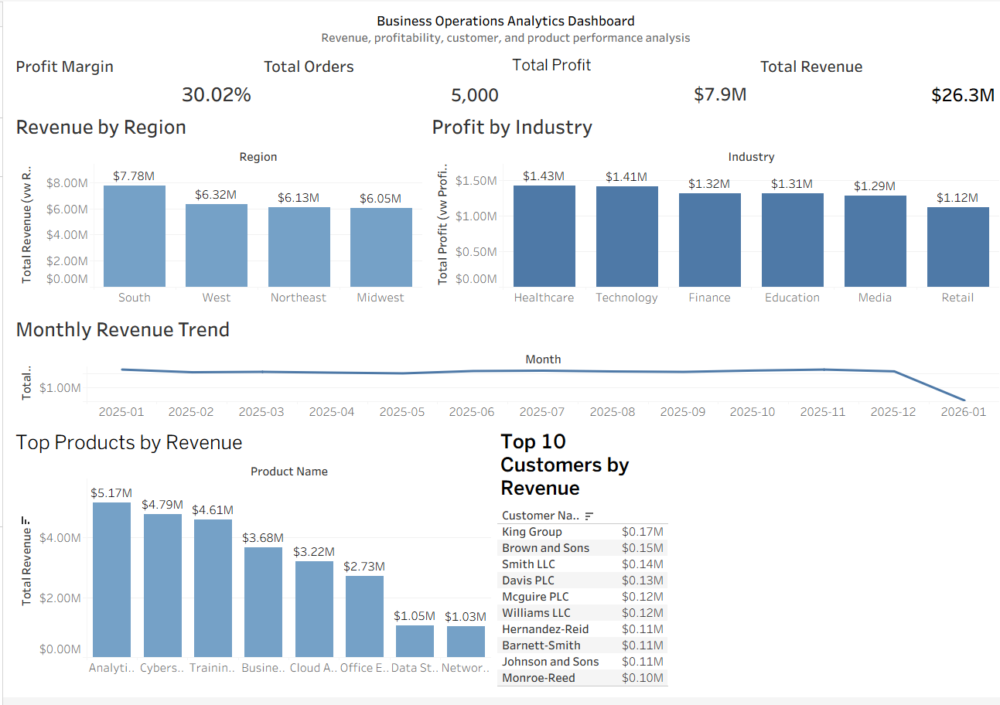

# 📊 Business Operations Analytics Dashboard

## Overview

A business intelligence project analyzing sales, customer, product, and profitability data using **Python, SQL Server, and Tableau**.

This project demonstrates a complete analytics workflow by generating and transforming business data, storing it in a relational database, creating reusable SQL views, and developing an interactive Tableau dashboard to uncover business insights.

---

## 🚀 Project Workflow
Python
↓
Data Generation & Cleaning
↓
CSV Files
↓
SQL Server Database
↓
SQL Analytics Views
↓
Tableau Dashboard
↓
Business Insights

---

# 🛠️ Technologies Used

### Programming & Data Analysis
- Python
- Pandas
- Faker
- Data Cleaning
- Exploratory Data Analysis

### Database
- Microsoft SQL Server
- SQL Queries
- Joins
- Aggregations
- Views

### Visualization
- Tableau Desktop
- Interactive Dashboards
- Business Reporting

### Tools
- VS Code
- Git/GitHub

---

# 📂 Project Structure
Business-Operations-Analytics/

│
├── data/
│ ├── customers.csv
│ ├── products.csv
│ ├── orders.csv
│ └── transactions.csv
│
├── analysis.py
├── business_analysis.py
│
├── sql/
│ ├── vw_Revenue_By_Region.sql
│ ├── vw_Profit_By_Industry.sql
│ ├── vw_Product_Performance.sql
│ ├── vw_Top_Customers.sql
│ ├── vw_Monthly_Revenue.sql
│ └── vw_Business_KPIs.sql
│
├── screenshots/
│ ├── business-dashboard-overview.png
│ ├── sql-server-database.png
│ └── python-analysis-results.png
│
└── README.md

---

# 📈 Dashboard Features

The Tableau dashboard includes:

## Key Performance Indicators

- Total Revenue
- Total Profit
- Total Orders
- Profit Margin

## Business Analysis

### Revenue by Region
Analyzes which geographic regions contribute the most revenue.

### Profit by Industry
Identifies the industries generating the highest profitability.

### Product Performance
Analyzes top-performing products and services based on revenue.

### Monthly Revenue Trends
Tracks sales patterns over time and identifies unusual changes.

### Top Customers
Highlights high-value customers contributing the most revenue.

---

# 📊 Business Insights

## Revenue Performance

- Total Revenue: **$26.28M**
- Total Orders: **5,000**
- Average Order Value: **$5,255.89**

## Profitability

- Total Profit: **$7.89M**
- Profit Margin: **30.02%**

## Key Findings

- The **South region generated the highest revenue**.
- **Healthcare and Technology industries produced the strongest profitability**.
- **Analytics Consulting was the highest revenue-generating product/service**.
- Revenue remained consistent throughout 2025, averaging around $2M+ monthly.
- January 2026 showed a significant decrease requiring additional investigation.

---

# 🗄️ SQL Server Analytics Views

Created reusable reporting views:

| View | Purpose |
|---|---|
| vw_Business_KPIs | Executive metrics |
| vw_Revenue_By_Region | Regional revenue analysis |
| vw_Profit_By_Industry | Industry profitability |
| vw_Product_Performance | Product revenue analysis |
| vw_Top_Customers | Customer ranking |
| vw_Monthly_Revenue | Time-series trends |

---

# 📸 Dashboard Preview

(Add your Tableau screenshot here)

---

# 🎯 Skills Demonstrated

- Data cleaning and transformation
- Python-based analytics workflows
- Relational database design
- SQL querying and optimization
- Business KPI development
- Data visualization
- Dashboard storytelling

---

# 📬 Contact

**Vale Rodriguez**

GitHub: https://github.com/valebela

LinkedIn: https://linkedin.com/in/valebela

