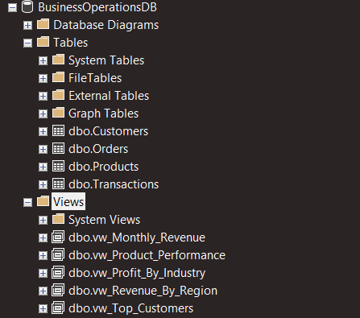
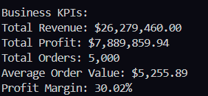

# Business Operations Analytics Dashboard

## Overview

A full-stack business analytics project that transforms raw operational data into actionable insights using **Python, SQL Server, and Tableau**.

This project demonstrates an end-to-end analytics workflow:

**Data Generation → Data Processing → Database Storage → SQL Analysis → Tableau Visualization**

The goal was to analyze business performance across revenue, profitability, customers, products, and regional trends through interactive reporting.

---

# Project Workflow 

```
Python
  ↓
Data Generation & Cleaning
  ↓
CSV Data Files
  ↓
SQL Server Database
  ↓
SQL Analytics Views
  ↓
Tableau Dashboard
  ↓
Business Insights
```

---

#  Technologies Used

## Programming & Data Analysis

* Python
* Pandas
* Faker
* Data Cleaning
* Exploratory Data Analysis

## Database

* Microsoft SQL Server
* SQL Queries
* Aggregations
* Data Modeling
* SQL Views

## Visualization

* Tableau Desktop
* Interactive Dashboards
* KPI Reporting
* Business Intelligence

## Tools

* VS Code
* Git
* GitHub

---

#  Project Structure

```
Business-Operations-Analytics/

│
├── data/
│   ├── customers.csv
│   ├── products.csv
│   ├── orders.csv
│   └── transactions.csv
│
├── sql/
│   └── business_analysis_queries.sql
│
├── tableau/
│   └── business_sales_dashboard.csv
│
├── screenshots/
│   ├── business-dashboard-overview.png
│   ├── python-analysis-results.png
│   └── sql-server-database.png
│
├── analysis.py
├── business_analysis.py
└── README.md
```

---

# Dashboard Preview

## Business Operations Analytics Dashboard

The Tableau dashboard provides an overview of business performance through key metrics and visual analysis.


---

# Dashboard Features

## Key Performance Indicators

The dashboard tracks:

* Total Revenue
* Total Profit
* Total Orders
* Profit Margin
* Average Order Value

---

## Revenue Analysis

### Revenue by Region

Analyzes geographic performance to identify which regions generate the highest revenue.

---

## Profitability Analysis

### Profit by Industry

Examines industry-level profitability to understand which customer segments contribute the most profit.

---

## Product Performance

Analyzes products and services based on revenue contribution.

Top-performing offerings include:

* Analytics Consulting
* Cybersecurity Package
* Training Services
* Business Laptop
* Cloud Analytics Platform

---

## Customer Analysis

Identifies high-value customers based on revenue contribution.

This supports customer relationship management and business growth strategies.

---

## Revenue Trends

Tracks monthly revenue patterns to identify:

* Growth trends
* Consistency
* Potential anomalies

---

#  SQL Server Analysis

SQL Server was used to create reusable analytical views for Tableau reporting.

Created views include:

| View                | Purpose                             |
| ------------------- | ----------------------------------- |
| Business KPIs       | Executive-level performance metrics |
| Revenue by Region   | Geographic revenue analysis         |
| Profit by Industry  | Industry profitability              |
| Product Performance | Product revenue analysis            |
| Top Customers       | Customer ranking                    |
| Monthly Revenue     | Time-based revenue trends           |

Database setup:

```
Server:
localhost\SQLEXPRESS

Database:
BusinessOperationsDB
```

SQL Server database preview:



---

#  Python Data Processing

Python was used to generate, clean, and analyze operational datasets.

Tasks included:

* Creating realistic business datasets
* Data validation
* Data transformation
* KPI calculations
* Preparing Tableau-ready data

Python analysis results:



---

#  Business Insights

Key findings from the analysis:

### Revenue Performance

* Total Revenue: **$26.28M**
* Total Orders: **5,000**
* Average Order Value: **$5,255.89**

### Profitability

* Total Profit: **$7.89M**
* Profit Margin: **30.02%**

### Findings

* The South region generated the highest revenue.
* Healthcare and Technology industries showed the strongest profitability.
* Analytics Consulting was the highest revenue-generating product/service.
* Revenue remained stable throughout 2025 with monthly performance above $2M.

---

# Skills Demonstrated

This project demonstrates experience with:

* Python data analysis workflows
* Pandas data manipulation
* SQL Server database management
* Creating analytical SQL views
* Business KPI development
* Tableau dashboard design
* Data visualization
* Translating data into business insights

---

#  Contact

**Vale Rodriguez**

GitHub: https://github.com/valebela

LinkedIn: https://linkedin.com/in/valebela
